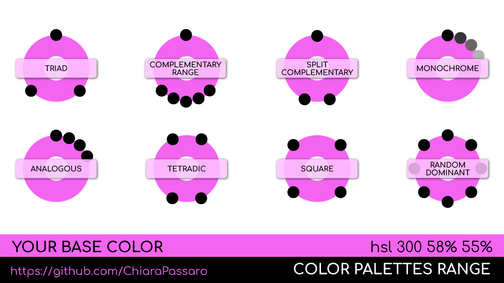
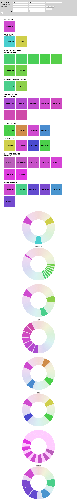

# @chiarapassaro/color-palettes-range


Generate many color schemes from a color

V1.1.1


##Install
```
$ npm init
$ npm install @chiarapassaro/color-palettes-range
```

##Usage
```
var ColorPalettesRange = require("@chiarapassaro/color-palettes-range/js");
```

## Functionality

### Create Hsl color:<br/>
```
var baseColor = new ColorPalettesRange.Hsl(hue, saturation, brightness)
```

##### Arguments: <br/>
Hue degree (1-360)<br/>
Saturation (1-100)<br/> 
Brightness (1-100)<br/>

##### Methods:
```
baseColor.getHue() -> number
baseColor.getSaturation() -> number
baseColor.getBrightness() -> number
baseColor.setHue(number) 
baseColor.setSaturation(number)
baseColor.setBrightness(number)
baseColor.printHsl() -> string hsl(hue, saturation% , brightness%)

```

### Create palettes:<br/>
```
var palettes = new ColorPalettesRange.SetColorPalette(baseColor)
```
##### Arguments: <br/>
Base Color  [obj Hsl]

##### Methods:

### Base Color
```
palettes.getBasecolor() -> obj Hsl()
updateColorPalette(newColor)
```
### Triadic:<br/>
#### Create Triadic scheme:<br/>
```
palettes.triad()
```
##### Return:
```
Array [obj Hsl(), obj Hsl(), ...]
```
#### Get palettes Triadica 
```
palettes.getTriad()
```
##### Return:
```
Array [obj Hsl(), obj Hsl(), ...]
```


### Create Complementary palettes:<br/>
```
palettes.complementar(numColor, stepDegree)
```
##### Arguments:<br/>
Color number - even <br/>
Step degree between colors<br/>
Max degree numColor*step = 140<br/>
##### Return:
```
Array [obj Hsl(), obj Hsl(), ...]
```
#### Get palettes complementary colors 
```
palettes.getComplementar()
```
##### Return:
```
Array [obj Hsl(), obj Hsl(), ...]
```


### Create Split complementary palettes:<br/>
```
palettes.splitComplementar()
```
##### Return:
```
Array [obj Hsl(), obj Hsl()]
```
#### Get palettes Split complementary colors 
```
palettes.splitComplementar()
```
##### Return:
```
Array [obj Hsl(), obj Hsl(), ...]
```


### Crea Analogous palettes:<br/>
```
palettes.analogous(typeScheme, numColor, stepDegree)
```
##### Arguments:<br/>
Scheme Type: 'allArch', 'cold', 'warm'<br/> 
Colors number - even<br/>
Step degree between colors<br/>
Max degree numColor*step = 60<br/>
##### Return:
```
Array [obj Hsl(), obj Hsl(), ...]
```
#### Get analogous colors 
```
palettes.getAnalogous()
```
##### Return:
```
Array [obj Hsl(), obj Hsl(), ...]
```


### Create tetradic palettes:<br/>
```
palettes.tetradic()
```
##### Return:
```
Array [obj Hsl(), obj Hsl()]
```
#### Get Tradic Colors
```
palettes.getTetradic()
```
##### Return:
```
Array [obj Hsl(), obj Hsl(), ...]
```


### Create Square palettes:<br/>
```
palettes.square()
```
##### Return:
```
Array [obj Hsl(), obj Hsl()]
```
#### Get Square colors
```
palettes.getSquare()
```
##### Return:
```
Array [obj Hsl(), obj Hsl(), ...]
```

### Create Monochrome palettes:<br/>
```
palettes.mono (numColor, stepDegree, typeScheme)
```
##### Arguments:<br/>
Colors number - even<br/>
Step degree between colors<br/>
Max degree numColor*step = 100<br/>
Scheme type = Saturation / Brightness
##### Return:
```
Array [obj Hsl(), obj Hsl()]
```
#### Get Monochrome colors 
```
palettes.getMono()
```
##### Return:
```
Array [obj Hsl(), obj Hsl(), ...]
```


### Create Random with Dominat Color palettes
```
palettes.randomDominant(numColor, percDominant
```
##### Arguments:<br/>
Colors number - even<br/>
Color Dominant Percentage<br/>
##### Return:
```
Array [obj Hsl(), obj Hsl()]
```
#### Get Random Dominant colors 
```
palettes.getRandomDominant()
```
##### Return:
```
Array [obj Hsl(), obj Hsl(), ...]
```


## Conversion Utilities
### Convert Hsl color:<br/>
```
var color = new ColorPalettesRange.HslConvert(hue, saturation, brightness)
```

##### Arguments: <br/>
hue (1-360)<br/>
saturation (1-100)<br/> 
brightness (1-100)<br/>

##### Methods:
```
color.getRgb() -> [Obj] new Rgb(r, g, b) 
color.getRed() -> number
color.getGreen() -> number
color.getBlue() -> number
color.getHex() -> [Obj] new Hex(#RRGGBB) 
```

### Convert Rgb color:<br/>
```
var color = new ColorPalettesRange.RgbConvert(r, g, b)
```

##### Arguments: <br/>
r (1-255)<br/>
g (1-255)<br/> 
b (1-255)<br/>

##### Methods:
```
color.getHsl() -> [Obj] new Hsl(hue, saturation, brightness)
color.getHue() -> number
color.getSaturation() -> number
color.getBrightness() -> number
color.getHex() -> [Obj] new Hex(#RRGGBB) 
```
 
### Convert Hex color:<br/>
```
var color = new ColorPalettesRange.HexConvert(#RRGGBB)
```

##### Arguments: <br/>
hex (#RRGGBB)<br/>

##### Methods:
```
color.getRgb() -> [Obj] new Rgb(r, g, b) 
color.getRed() -> number
color.getGreen() -> number
color.getBlue() -> number
color.getHsl() -> [Obj] new Hsl(hue, saturation, brightness)
color.getHue() -> number
color.getSaturation() -> number
color.getBrightness() -> number
```
 
### Create Rgb color:<br/>
```
var color = new ColorPalettesRange.Rgb(r, g, b)
```

##### Arguments: <br/>
Red (1-255)<br/>
Green (1-255)<br/> 
Blue (1-255)<br/>

##### Methods:
```
color.getRed() -> number
color.getGreen() -> number
color.getBlue() -> number
color.printHsl() -> string rgb(r, g , b)
color.setRed(number)
color.setBlue(number)
color.setGreen(number)

```

### Create Hex color:<br/>
```
var color = new ColorPalettesRange.Hex(#RRGGBB)
```

##### Arguments: <br/>
\#RRGGBB

##### Methods:
```
color.printHex() -> string #RRGGBB
color.setHex(#RRGGBB)
```


# Italian Instructions

# @chiarapassaro/color-palettes-range

Package che genera diversi tipi di palette a partire da un colore di base


V1.1.1

##Installazione
```
$ npm init
$ npm install @chiarapassaro/color-palettes-range
```

##Utilizzo
```
var ColorPalettesRange = require("@chiarapassaro/color-palettes-range/js");
```

## Funzionalità

### Crea colore Hsl:<br/>
```
var baseColor = new ColorPalettesRange.Hsl(hue, saturation, brightness)
```

##### Argomenti: <br/>
Tonalità in gradi (1-360)<br/>
Saturazione (1-100)<br/> 
Luminosità (1-100)<br/>

##### Metodi:
```
baseColor.getHue() -> number
baseColor.getSaturation() -> number
baseColor.getBrightness() -> number
baseColor.setHue(number) 
baseColor.setSaturation(number)
baseColor.setBrightness(number)
baseColor.printHsl() -> string hsl(hue, saturation% , brightness%)

```

### Crea palette:<br/>
```
var palettes = new ColorPalettesRange.SetColorPalette(baseColor)
```
##### Argomenti: <br/>
Colore di base [obj Hsl]

##### Metodi:

### Colore di base
```
palettes.getBasecolor() -> obj Hsl()
updateColorPalette(newColor)
```
### Palette Triadica:<br/>
#### Crea palettes Triadica:<br/>
```
palettes.triad()
```
##### Ritorna:
```
Array [obj Hsl(), obj Hsl(), ...]
```
#### Get palettes Triadica 
```
palettes.getTriad()
```
##### Ritorna:
```
Array [obj Hsl(), obj Hsl(), ...]
```


### Crea palettes di colori complementari:<br/>
```
palettes.complementar(numColor, stepDegree)
```
##### Argomenti:<br/>
Numero di colori desiderati - numero pari <br/>
Step in gradi tra un colore e l'altro<br/>
Gradi massimi consentiti numColor*step = 140<br/>
##### Ritorna:
```
Array [obj Hsl(), obj Hsl(), ...]
```
#### Get palettes di colori complementari 
```
palettes.getComplementar()
```
##### Ritorna:
```
Array [obj Hsl(), obj Hsl(), ...]
```


### Crea palettes di colori complementari divergenti:<br/>
```
palettes.splitComplementar()
```
##### Ritorna:
```
Array [obj Hsl(), obj Hsl()]
```
#### Get palettes di colori complementari divergenti 
```
palettes.splitComplementar()
```
##### Ritorna:
```
Array [obj Hsl(), obj Hsl(), ...]
```


### Crea palettes di colori analoghi:<br/>
```
palettes.analogous(typeScheme, numColor, stepDegree)
```
##### Argomenti:<br/>
Tipo di schema: 'allArch', 'cold', 'warm'<br/> 
Numero di colori desiderati - numero pari<br/>
Step in gradi tra un colore e l'altro<br/>
Gradi massimi consentiti numColor*step = 60<br/>
##### Ritorna:
```
Array [obj Hsl(), obj Hsl(), ...]
```
#### Get palettes di colori analoghi 
```
palettes.getAnalogous()
```
##### Ritorna:
```
Array [obj Hsl(), obj Hsl(), ...]
```


### Crea palettes di colori tetradica:<br/>
```
palettes.tetradic()
```
##### Ritorna:
```
Array [obj Hsl(), obj Hsl()]
```
#### Get palettes di colori tetradica 
```
palettes.getTetradic()
```
##### Ritorna:
```
Array [obj Hsl(), obj Hsl(), ...]
```


### Crea palettes di colori quadratica:<br/>
```
palettes.square()
```
##### Ritorna:
```
Array [obj Hsl(), obj Hsl()]
```
#### Get palettes di colori quadratica 
```
palettes.getSquare()
```
##### Ritorna:
```
Array [obj Hsl(), obj Hsl(), ...]
```


### Crea palettes di colori monocromo:<br/>
```
palettes.mono (numColor, stepDegree, typeScheme)
```
##### Argomenti:<br/>
Numero di colori desiderati - numero pari <br/>
Step in gradi tra un colore e l'altro<br/>
Gradi massimi consentiti numColor*step = 100<br/>
Tipo di schema = Saturation / Brightness
##### Ritorna:
```
Array [obj Hsl(), obj Hsl()]
```
#### Get palettes di colori monocromo 
```
palettes.getMono()
```
##### Ritorna:
```
Array [obj Hsl(), obj Hsl(), ...]
```


### Crea palettes di colori Random con Dominante
```
palettes.randomDominant(numColor, percDominant
```
##### Argomenti:<br/>
Numero di colori desiderati - numero pari <br/>
Percentuale del colore di base dominante<br/>
##### Ritorna:
```
Array [obj Hsl(), obj Hsl()]
```
#### Get palettes di colori Random con Dominante 
```
palettes.getRandomDominant()
```
##### Ritorna:
```
Array [obj Hsl(), obj Hsl(), ...]
```


## Utility di conversione
### Converte colore Hsl:<br/>
```
var color = new ColorPalettesRange.HslConvert(hue, saturation, brightness)
```

##### Argomenti: <br/>
hue (1-360)<br/>
saturation (1-100)<br/> 
brightness (1-100)<br/>

##### Metodi:
```
color.getRgb() -> [Obj] new Rgb(r, g, b) 
color.getRed() -> number
color.getGreen() -> number
color.getBlue() -> number
color.getHex() -> [Obj] new Hex(#RRGGBB) 
```

### Converte colore Rgb:<br/>
```
var color = new ColorPalettesRange.RgbConvert(r, g, b)
```

##### Argomenti: <br/>
r (1-255)<br/>
g (1-255)<br/> 
b (1-255)<br/>

##### Metodi:
```
color.getHsl() -> [Obj] new Hsl(hue, saturation, brightness)
color.getHue() -> number
color.getSaturation() -> number
color.getBrightness() -> number
color.getHex() -> [Obj] new Hex(#RRGGBB) 
```
 
### Converte colore Esadecimale:<br/>
```
var color = new ColorPalettesRange.HexConvert(#RRGGBB)
```

##### Argomenti: <br/>
hex (#RRGGBB)<br/>

##### Metodi:
```
color.getRgb() -> [Obj] new Rgb(r, g, b) 
color.getRed() -> number
color.getGreen() -> number
color.getBlue() -> number
color.getHsl() -> [Obj] new Hsl(hue, saturation, brightness)
color.getHue() -> number
color.getSaturation() -> number
color.getBrightness() -> number
```
 
### Crea colore Rgb:<br/>
```
var color = new ColorPalettesRange.Rgb(r, g, b)
```

##### Argomenti: <br/>
Red (1-255)<br/>
Green (1-255)<br/> 
Blue (1-255)<br/>

##### Metodi:
```
color.getRed() -> number
color.getGreen() -> number
color.getBlue() -> number
color.printHsl() -> string rgb(r, g , b)
color.setRed(number)
color.setBlue(number)
color.setGreen(number)

```

### Crea colore Esadecimale:<br/>
```
var color = new ColorPalettesRange.Hex(#RRGGBB)
```

##### Argomenti: <br/>
\#RRGGBB

##### Metodi:
```
color.printHex() -> string #RRGGBB
color.setHex(#RRGGBB)
```


#Example with ChartJs Wheels

